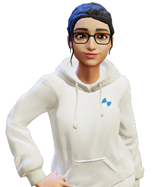

<h1 align="center" >Sobre mim...</h1>

- Me chamo Queren ✌  
- Me aperfeiçoando cada dia mais com a programação  
- Formada como Desenvolvedora FullStack pela Kenzie Academy Brasil  
- Um pézinho maior no Front End  
- Amo contato com a natureza   
- Atualmente estudando mais e mais em cursos  
- Responsabilidade com a minha empresa  
- Sou uma pessoa calma  
- A tecnologia é o nosso futuro!!!  

  

  
***************
***************

  <a href="https://github.com/QuerenHope">
  
  

<h2 align="center">Linguagens e Ferramentas</h2>
  <h3 align="center">Front End</h3>
  

     
     
     
     
           
  

  
  <h3 align="center">Back End</h3>
  

     
    
      
               
  

  
  <h3 align="center">Banco de Dados</h3>
  

    
    
  

  
  <h3 align="center">DevOps</h3>
  

    
            
  

  
  <h3 align="center">Ferramentas</h3>
  

    
        
     
     
  

***************
  
 

<h2 align="center">Entre em contato:</h2>

   
***************
